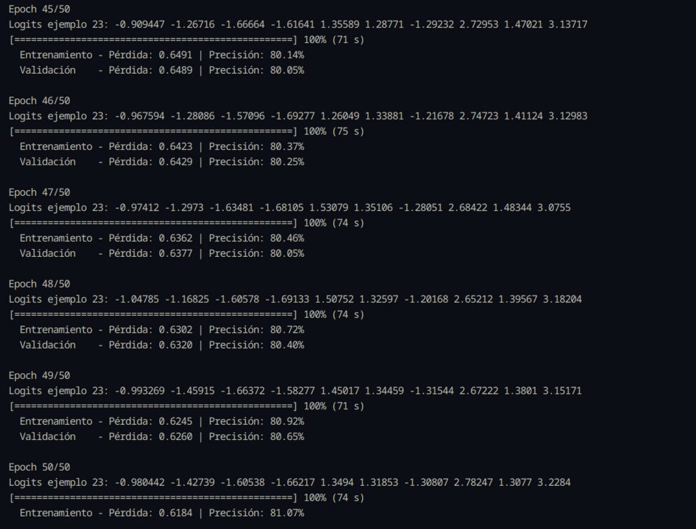
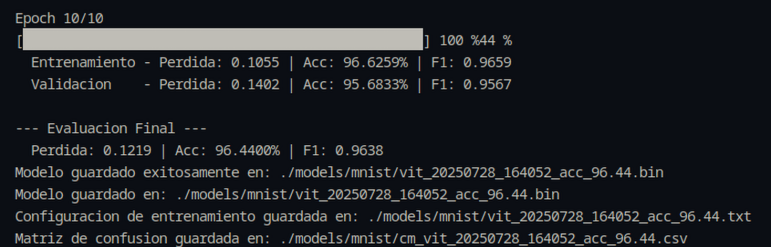
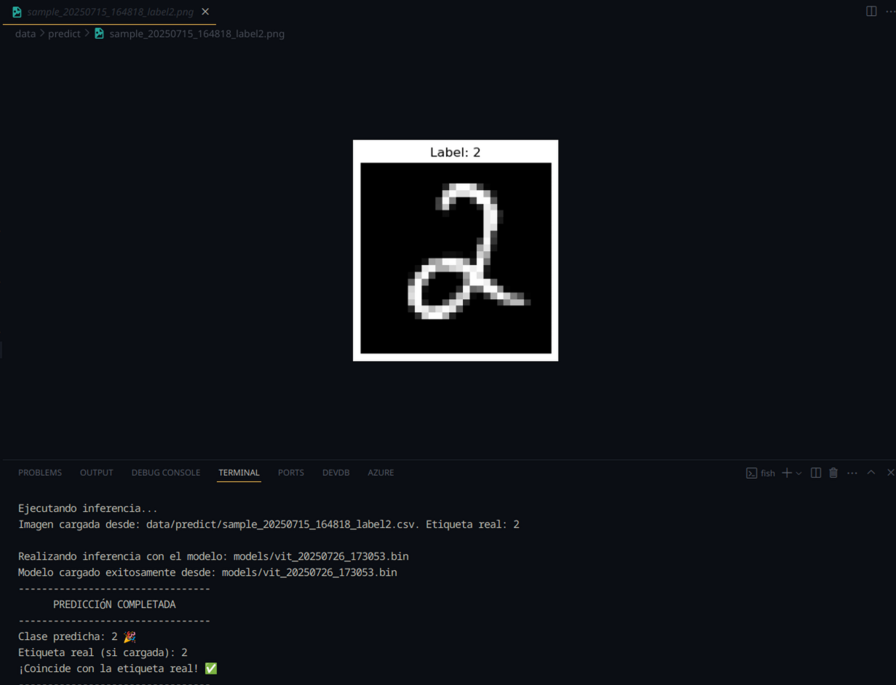
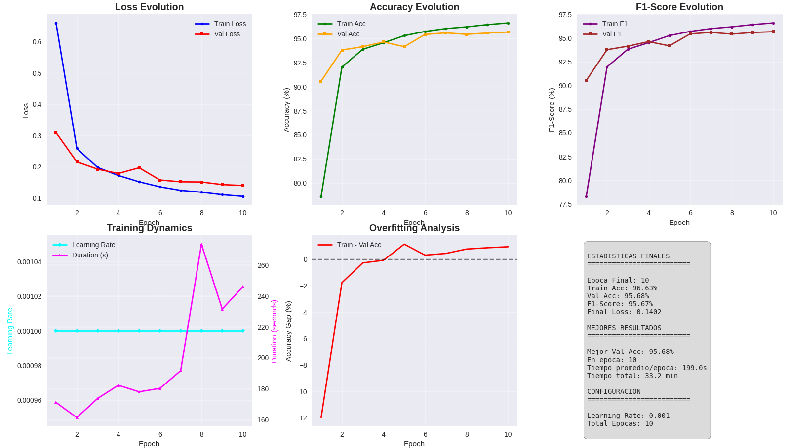
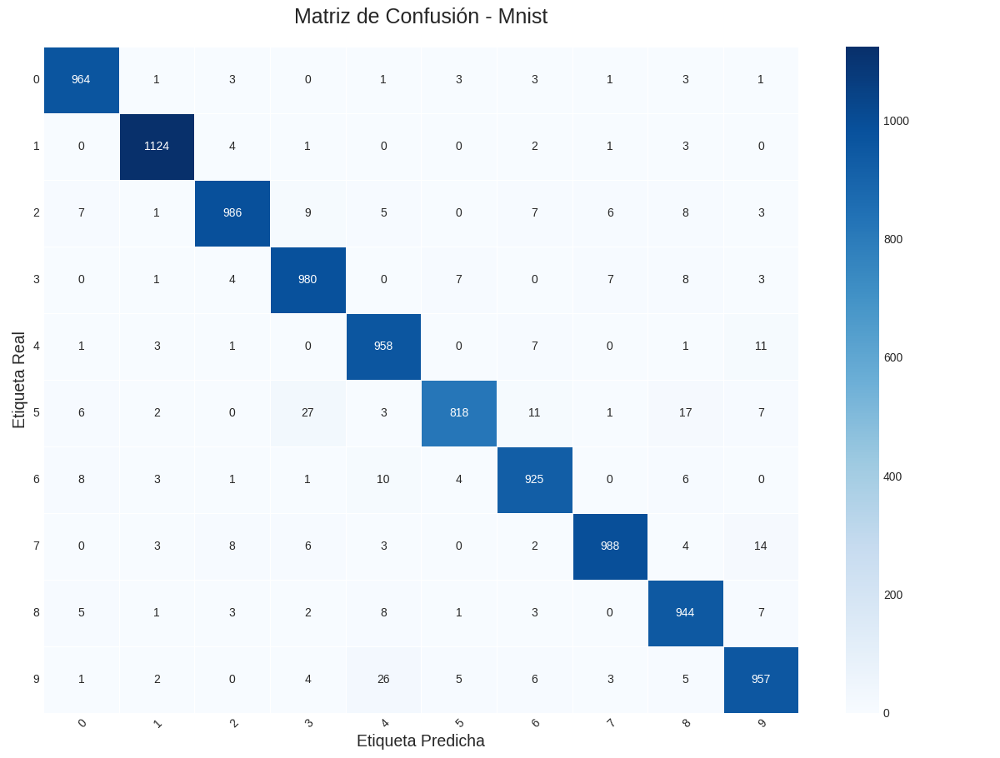
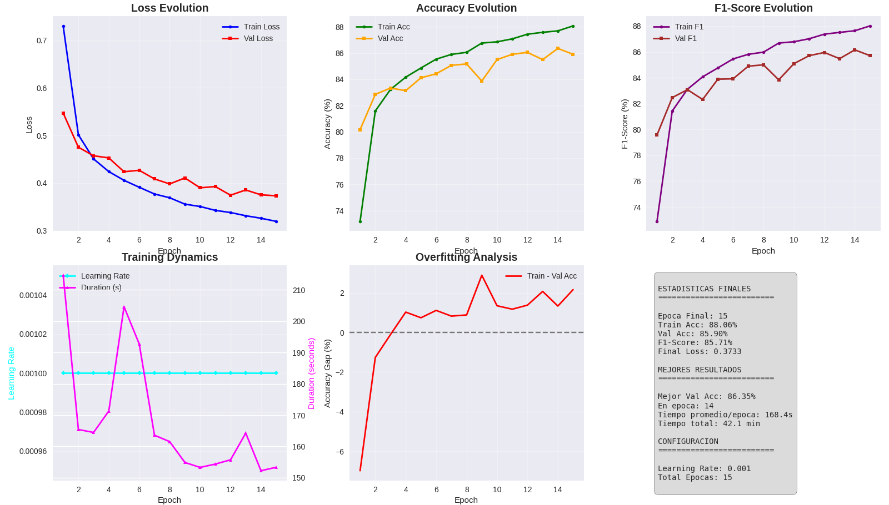
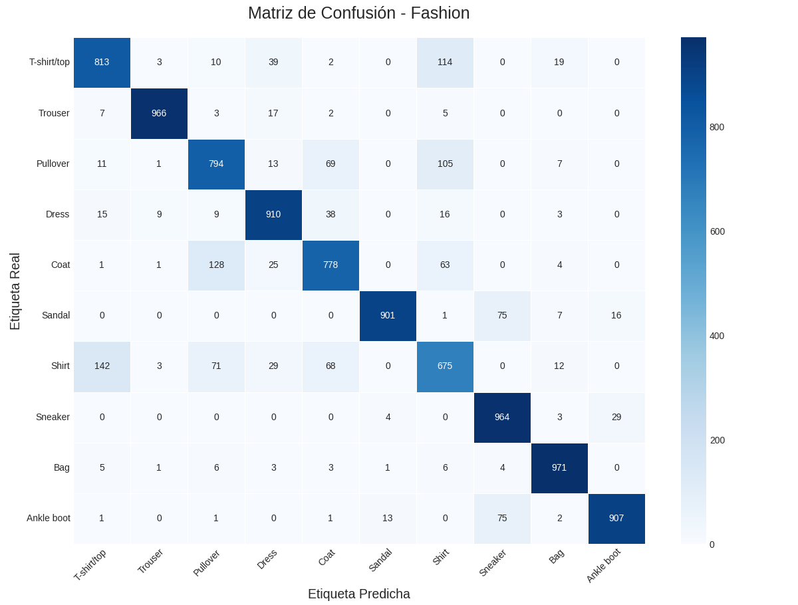
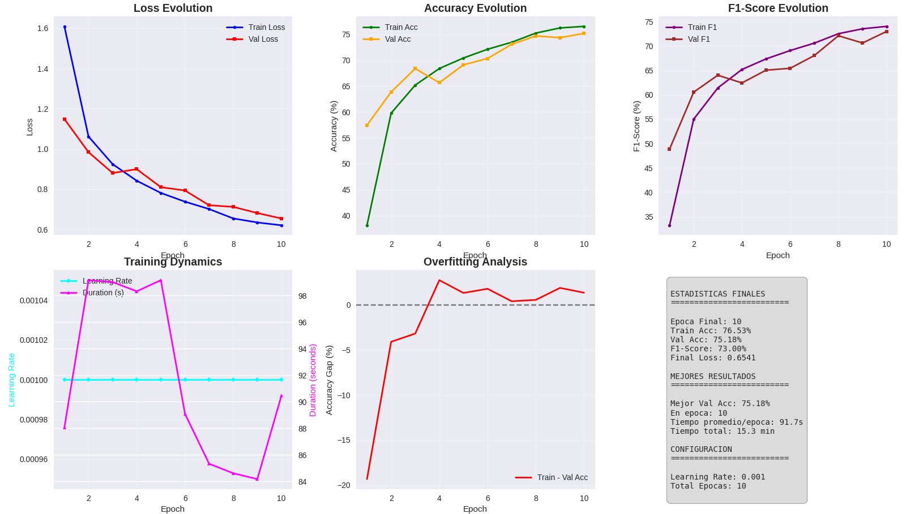
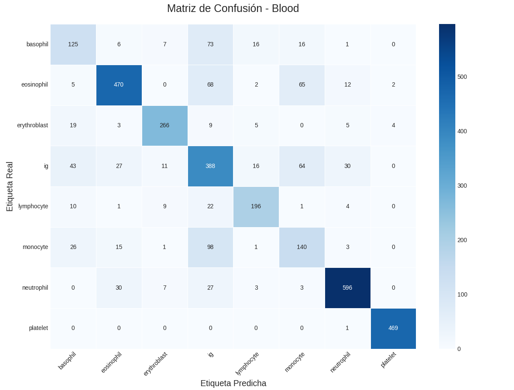

<!-- omit from toc -->
# Vision Transformer

- Kevin Joaquin Chambi Tapia
- Victor Alejandro Quicaño Miranda
- Eduardo German Ruiz Mamani
- Sebastian Agenor Zamalloa Molina

Este proyecto implementa un modelo **Vision Transformer (ViT)** utilizando únicamente **CUDA y C++**. La implementación es educativa y busca comprender los fundamentos del paper ["An Image is Worth 16x16 Words: Transformers for Image Recognition at Scale" (Dosovitskiy et al., 2020)](https://arxiv.org/pdf/2010.11929).

A diferencia de las redes neuronales convolucionales tradicionales, este enfoque transforma una imagen en pequeños *patches* que son procesados como secuencias, permitiendo el uso de la arquitectura Transformer originalmente diseñada para tareas de procesamiento de lenguaje natural.

<!-- omit from toc -->
## Contenido
- [Objetivo](#objetivo)
- [¿Qué es Vision Transformer?](#qué-es-vision-transformer)
- [Cómo compilar y ejecutar](#cómo-compilar-y-ejecutar)
- [Explicación del código](#explicación-del-código)
- [Entrenamiento](#entrenamiento)
- [Predicción](#predicción)
- [Resultados](#resultados)
  - [MNIST](#mnist)
  - [Fashion-MNIST](#fashion-mnist)
  - [Blood-MNIST](#blood-mnist)


## Objetivo

El objetivo principal es explorar cómo los Transformers pueden aplicarse al reconocimiento visual desde cero, sin depender de frameworks de alto nivel, y acelerando el entrenamiento e inferencia mediante **CUDA** y **programación en bajo nivel con C++**.

## ¿Qué es Vision Transformer?

El **Vision Transformer (ViT)** divide una imagen en bloques fijos (por ejemplo, de 16x16 píxeles), los aplane y los trate como "palabras" o tokens. Estos tokens se procesan mediante una serie de capas Transformer, seguidas por una capa final de clasificación.
<!-- omit from toc -->
### Características clave:
- División de imágenes en *patches*.
- Uso de embeddings aprendidos para cada patch.
- Inserción de un token especial `[CLS]` para la clasificación.
- Uso de atención multi-cabeza y posiciones absolutas aprendidas.


<!-- ## Referencias

- [An Image is Worth 16x16 Words: Transformers for Image Recognition at Scale](https://arxiv.org/pdf/2010.11929)
- [Attention Is All You Need](https://arxiv.org/abs/1706.03762)

## Notebooks
- [ViT - Keras](https://colab.research.google.com/drive/1OlspI87qJouwFWuTzH2k29ai4XsfYnrT?usp=sharing)
- [ViT - Pytorch](https://colab.research.google.com/drive/1J_GLR-PMsMiuiRqsPXpJXCT8LMaOfuq1?usp=sharing) -->

## Cómo compilar y ejecutar

Este proyecto utiliza un `Makefile` para la compilación y un script `run.sh` para simplificar la ejecución.
<!-- omit from toc -->
### Requisitos

  * Un compilador de C++ compatible con C++17 (ej. `g++`).
  * La utilidad `make`.
  * Python 3 para scripts auxiliares.
<!-- omit from toc -->
### Uso del script `run.sh`

**1. Dar permisos de ejecución (solo una vez):**

```bash
chmod +x run.sh
```

2. Comandos disponibles:

Entrenar el modelo:
Usa un archivo de configuración para definir todos los hiperparámetros.

```bash
./run.sh train <ruta_a_config.cfg>
```

Ejemplo:

```bash
./run.sh train models/configs/mnist_small.cfg
```

Evaluar un modelo:
Genera la matriz de confusión para un modelo entrenado.

```
./run.sh evaluate <ruta_al_modelo.bin> <nombre_dataset>
```

Ejemplo:

```bash
./run.sh evaluate models/mnist/vit_...bin mnist
```

Predecir con una imagen aleatoria:
Extrae una imagen al azar de un dataset y usa el modelo más reciente.

```bash
./run.sh predict [nombre_dataset]
```

Ejemplo (usa mnist por defecto):

```bash
./run.sh predict fashionmnist
```

Hacer inferencia directa:
Realiza una predicción sobre un archivo de imagen específico.

```bash
./run.sh infer <modelo.bin> <imagen.csv>
```

Limpiar el proyecto:
Elimina los archivos de compilación.

```bash
./run.sh clean
```

Perfecto, con base en tu estructura de archivos y el contenido actual del `README`, podrías insertar una sección **"Explicación del código"** que detalle la arquitectura y módulos principales. Aquí te dejo una versión integrada para que simplemente pegues en tu `README.md` (después de la sección de "Referencias" o antes de "Cómo compilar y ejecutar"):

---

## Explicación del código
<!-- omit from toc -->
### Arquitectura general

El modelo está dividido modularmente en componentes inspirados en la arquitectura Transformer original:

```bash
src/
├── core/           # Componentes fundamentales como tensores y funciones de activación
├── model/          # Arquitectura del modelo Transformer
├── optimizer/      # Optimizadores implementados manualmente
```
<!-- omit from toc -->
### Atención Multi-Cabeza

La atención se implementa en `model/multihead_attention.cpp`. Se construye a partir de:

* Proyecciones lineales para `Q`, `K`, `V` (query, key, value).
* Normalización por raíz de la dimensión (`1/sqrt(dk)`).
* Softmax sobre las similitudes `QK^T`.
* Producto con `V` para obtener el resultado por cabeza.
* Concatenación y proyección final.

Esto permite al modelo enfocarse en distintas partes de la imagen simultáneamente.
<!-- omit from toc -->
### Codificador (Transformer Encoder)

Ubicado en `model/encoder.cpp`, cada bloque encoder tiene:

* Atención multi-cabeza (`MultiHeadAttention`)
* Normalización (`LayerNorm`)
* MLP residual (Feed Forward)
* Normalización final

Se repiten en stack (definido por `n_layers` en config).
<!-- omit from toc -->
### Modelo Vision Transformer

En `model/vit.cpp`, se definen:

* División de imagen en *patches*.
* Embedding lineal para cada patch + posición.
* Inserción del token `[CLS]`.
* Stack de `Encoder` + capa final lineal de clasificación.
<!-- omit from toc -->
### Núcleo del sistema
<!-- omit from toc -->
#### `core/tensor.cpp`

Define un tipo de tensor liviano con soporte para operaciones básicas (suma, producto, reshape). Es la base para todos los cálculos.
<!-- omit from toc -->
#### `core/activation.cpp`

Contiene activaciones como ReLU, GELU, y Softmax.
<!-- omit from toc -->
#### `optimizer/*.cpp`

Implementaciones manuales de `SGD`, `Adam`, y `AdamW` siguiendo fórmulas originales con soporte para `weight decay`.

## Entrenamiento

...


## Predicción


## Resultados
### MNIST
Configuración: Se utilizó la configuración definida en configs/mnist.cfg.

Métricas Finales:
| Métrica              | Valor     |
| :------------------- | :-------- |
| Precisión (Accuracy) | 96.44%    |
| F1-Score (Macro)     | 0.9638    |

Curva de Entrenamiento:


Matriz de Confusión:


### Fashion-MNIST
Configuración: Se utilizó la configuración definida en configs/fashionmnist.cfg.

Métricas Finales:
| Métrica              | Valor     |
| :------------------- | :-------- |
| Precisión (Accuracy) | 86.79%    |
| F1-Score (Macro)     | 0.8678    |


Curva de Entrenamiento:


Matriz de Confusión:


### Blood-MNIST
Configuración: Se utilizó la configuración definida en configs/bloodmnist.cfg.

Métricas Finales:
| Métrica              | Valor     |
| :------------------- | :-------- |
| Precisión (Accuracy) | 0.77%    |
| F1-Score (Macro)     | 0.7513    |

Curva de Entrenamiento:


Matriz de Confusión:

