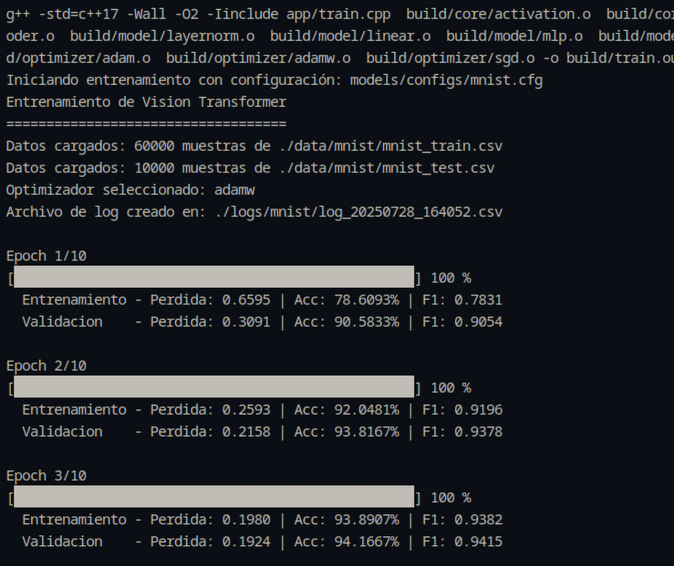

# Vision Transformer

Este proyecto implementa un modelo **Vision Transformer (ViT)** utilizando únicamente **CUDA y C++**. La implementación es educativa y busca comprender los fundamentos del paper ["An Image is Worth 16x16 Words: Transformers for Image Recognition at Scale" (Dosovitskiy et al., 2020)](https://arxiv.org/pdf/2010.11929).

A diferencia de las redes neuronales convolucionales tradicionales, este enfoque transforma una imagen en pequeños *patches* que son procesados como secuencias, permitiendo el uso de la arquitectura Transformer originalmente diseñada para tareas de procesamiento de lenguaje natural.

## Objetivo

El objetivo principal es explorar cómo los Transformers pueden aplicarse al reconocimiento visual desde cero, sin depender de frameworks de alto nivel, y acelerando el entrenamiento e inferencia mediante **CUDA** y **programación en bajo nivel con C++**.

## ¿Qué es Vision Transformer?

El **Vision Transformer (ViT)** divide una imagen en bloques fijos (por ejemplo, de 16x16 píxeles), los aplane y los trate como "palabras" o tokens. Estos tokens se procesan mediante una serie de capas Transformer, seguidas por una capa final de clasificación.

### Características clave:
- División de imágenes en *patches*.
- Uso de embeddings aprendidos para cada patch.
- Inserción de un token especial `[CLS]` para la clasificación.
- Uso de atención multi-cabeza y posiciones absolutas aprendidas.


## Referencias

- [An Image is Worth 16x16 Words: Transformers for Image Recognition at Scale](https://arxiv.org/pdf/2010.11929)
- [Attention Is All You Need](https://arxiv.org/abs/1706.03762)

## Notebooks
- [ViT - Keras](https://colab.research.google.com/drive/1OlspI87qJouwFWuTzH2k29ai4XsfYnrT?usp=sharing)
- [ViT - Pytorch](https://colab.research.google.com/drive/1J_GLR-PMsMiuiRqsPXpJXCT8LMaOfuq1?usp=sharing)

## Cómo compilar y ejecutar

Este proyecto utiliza un `Makefile` para la compilación y un script `run.sh` para simplificar la ejecución.

### Requisitos

  * Un compilador de C++ compatible con C++17 (ej. `g++`).
  * La utilidad `make`.
  * Python 3 para scripts auxiliares.

### Uso del script `run.sh`

**1. Dar permisos de ejecución (solo una vez):**

```bash
chmod +x run.sh
```

2. Comandos disponibles:

Entrenar el modelo:
Usa un archivo de configuración para definir todos los hiperparámetros.

```bash
./run.sh train <ruta_a_config.cfg>
```

Ejemplo:

```bash
./run.sh train models/configs/mnist_small.cfg
```

Evaluar un modelo:
Genera la matriz de confusión para un modelo entrenado.

```
./run.sh evaluate <ruta_al_modelo.bin> <nombre_dataset>
```

Ejemplo:

```bash
./run.sh evaluate models/mnist/vit_...bin mnist
```

Predecir con una imagen aleatoria:
Extrae una imagen al azar de un dataset y usa el modelo más reciente.

```bash
./run.sh predict [nombre_dataset]
```

Ejemplo (usa mnist por defecto):

```bash
./run.sh predict fashionmnist
```

Hacer inferencia directa:
Realiza una predicción sobre un archivo de imagen específico.

```bash
./run.sh infer <modelo.bin> <imagen.csv>
```

Limpiar el proyecto:
Elimina los archivos de compilación.

```bash
./run.sh clean
```

# Etrenamiento


# Resultados
## MNIST
Configuración: Se utilizó la configuración definida en configs/mnist.cfg.

Métricas Finales:
<!-- | Métrica | Valor |
| :--- | :--- |
| Precisión (Accuracy) | Tu resultado aquí |
| F1-Score (Macro) | Tu resultado aquí | -->

Predicción:


Curva de Entrenamiento:


Matriz de Confusión:


## Fashion-MNIST
Configuración: Se utilizó la configuración definida en configs/fashionmnist.cfg.

## Blood-MNIST
Configuración: Se utilizó la configuración definida en configs/bloodmnist.cfg.
